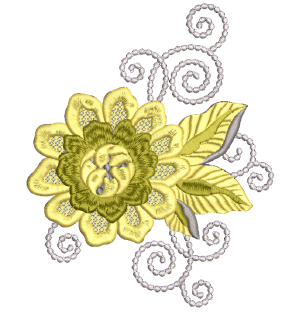
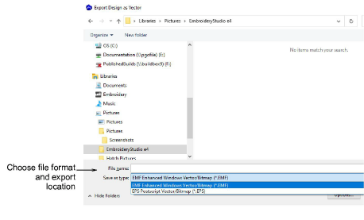

# Exporting embroidery as vectors

Once digitized in EmbroideryStudio, embroidery designs can be output as vectors. These can be opened in CorelDRAW Graphics. This can serve various purposes such as [appliqué](../../glossary/glossary) cutting, multimedia, screen printing, and so on. The Export Design as Vector command exports whole designs or selected objects only. Included bitmaps will remain as bitmaps in the resultant file.

## To export embroidery as vectors...

1Open the embroidery design for export.

2Optionally, select particular objects for export.

3Choose File > Export Design as Vector.

4Choose a file format – EPS or EMF – and export location.

5Once saved, open in CorelDRAW Graphics or third-party application for further processing.

## Related topics...

- [Creating vector shapes in EmbroideryStudio](../../Automatic/vectors/Creating_vector_shapes_in_EmbroideryStudio)
- [Loading vector artwork](../../Automatic/vectors/Loading_vector_artwork)
- [Visualizing vector graphics](../../Automatic/vectors/Visualizing_vector_graphics)
