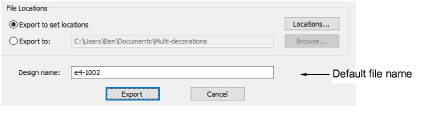

# File naming conventions

By default, the Design name field will take the current design name – e.g. ‘Design1’. You can change it if you wish. This name is applied to all files exported with the Export Multi-Decoration Files dialog.

If exported files for any components have the same selected file extension and location, the file name will be automatically suffixed as follows:

| Design Element | Suffix                    |
| -------------- | ------------------------- |
| Embroidery     | \_EMB                     |
| Graphics       | \_GFX                     |
| Appliqué       | \_APQ                     |
| Bling          | \_BLG (for a single file) |

## Example

The single multi-decoration file – ‘Design1.EMB’ – contains embroidery, graphic, appliqué, and bling components. Depending on chosen file types, you will see file names of the following kind:

| Design Element | File Type         | File Name       |
| -------------- | ----------------- | --------------- |
| Embroidery     | Wilcom EMB        | Design1_EMB.EMB |
| Graphic        | CorelDRAW         | Design1_GFX.CDR |
| Appliqué       | AutoCAD           | Design1_APQ.DXF |
| Bling          | Adobe Illustrator | Design1_BLG.AI  |

## Bling multi-file output

When bling objects in a design contain rhinestones of different size, shape, and/or color, and the Multiple Files output option is selected in the Settings dialog, files will take a suffix of the following form:

- &lt;filename&gt;_SSx_&lt;color&gt;
- &lt;filename&gt;_SSx_&lt;color&gt;\_&lt;shape_name&gt;
- &lt;filename&gt;_&lt;color&gt;_&lt;shape*name&gt;*&lt;XxY&gt;

For example, consider a design with the following bling types:

| Bling type                         | Output filename                 |
| ---------------------------------- | ------------------------------- |
| Navette 8 x 4mm with color Emerald | Design1_Emerald_Navette_8x4.PLT |
| Flower SS16 with color Crystal     | Design1_SS16_Crystal_Flower.PLT |
| SS04 with color Aquamarine         | Design1_SS04_Aquamarine.PLT     |

::: tip
The print preview shows which rhinestones are in which file.
:::

## Related topics...

- [Embroidery file formats](../../Management/formats/Embroidery_file_formats)
- [Output to bling cutter](Output_to_bling_cutter)
