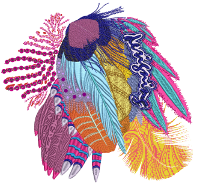

# Multi-Decoration Output

Designs digitized in EmbroideryStudio and CorelDRAW® can be output in a variety of ways, both via the Wilcom Workspace and CorelDRAW Graphics.

Firstly, EmbroideryStudio provides a ‘one-stop-shop’ for the output of mixed decoration. The Export Multi-Decoration Files capability allows you to output multi-decoration components for various processes. It can provide:

- Direct input to required machines – the most efficient method – or
- A file format which can be used by the machine’s supporting software.

This feature is accessed via a menu command in both Wilcom Workspace and CorelDRAW Graphics – File > Export Multi-Decoration Files.

For machines that support direct connection, there are two commands:

- File > Send to Appliqué Cutter
- File > Send to Bling Cutter

In order to output all multi-decoration components, it may be necessary to use more than one of these commands.

## Related topics...

- [Multi-decoration types](Multi-decoration_types)
- [Printing designs in CorelDRAW Graphics](Printing_designs_in_CorelDRAW_Graphics)
- [Exporting embroidery as vectors](Exporting_embroidery_as_vectors)
- [Exporting multiple decoration files](Exporting_multiple_decoration_files)
- [Outputting appliqué for production](Outputting_appliqué_for_production)
- [Outputting bling for production](Outputting_bling_for_production)
