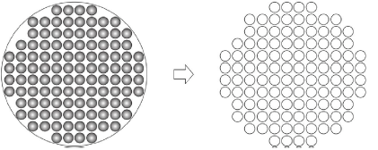
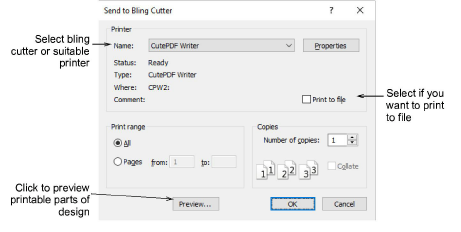
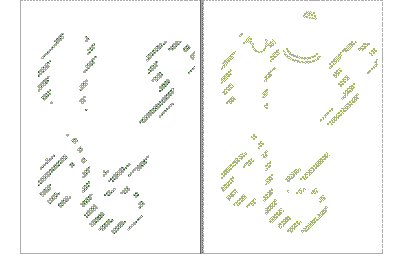

# Output to bling cutter

|  | Use Standard > Send to Bling Cutter to send vectors for any bling in a multi-decoration design to a supported cutting machine. |
| ------------------------------------------------------ | ------------------------------------------------------------------------------------------------------------------------------ |

The Send to Bling Cutter function sends vectors for any bling in a multi-decoration design directly to a cutting machine. Use it with any bling template cutter supported by MS Windows®.

## To output to a bling cutter...

1. Open or create a multi-decoration design. A cutting or engraving machine must be connected to the PC and configured to receive data.

2. Click the Send to Bling Cutter icon or select File > Send to Bling Cutter. The Send to Bling Cutter dialog opens.

3. Select your bling cutter from the droplist or select a suitable printer.

4. Select the Print to file option if you want to print the design to file.

5. Click Properties and check your output settings.

6. For a realistic view click the Preview button.

Note: In multi-bling designs, each color is separated into different templates for flood-filling.

7. Click OK to send the bling templates to bling cutter or to file.

The bling cutting/engraving information is sent to machine in the required format. The machine cuts the desired template/s. The cutting data consists solely of vectors which describe the location, size, and shape of the bling in the template. There are no connecting lines or data that do not relate directly to bling placement.

Tip: A bling production summary shows stone colors, sizes, and quantities as well as a summary on the first page.

## Related topics...

- [Set up machines](../../Setup/hardware/Set_up_machines1)
- [Print reports](../../Production/reports/Print_reports)
- [Customizing design reports](../../Production/reports/Customizing_design_reports)
