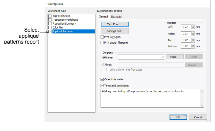
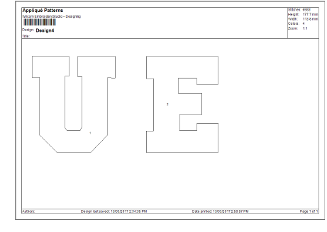

# Print appliqué patterns

Print appliqué patterns for use in cutting out fabric pieces. Each piece is numbered according to stitching sequence. One copy of placement outlines is printed at 100% scaling, with each outline separated for use in cutting the fabric.

## To print an appliqué pattern...

1Create or open an appliqué design.

2Select File > Print Preview and click the Options icon.

3Select Appliqué Patterns report type.

4Set General options and click OK. Each appliqué pattern is numbered according to the stitching sequence. Stitch count and colors are displayed.

5Click Print Now to output appliqué shapes to printer.

## Related topics...

- [Customizing design reports](../../Production/reports/Customizing_design_reports)
