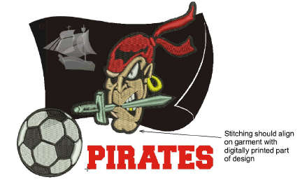

# Printing designs in CorelDRAW Graphics

To send a multi-decoration design to production, you generally print the digital art design before stitching the embroidery. To do this, you first need to hide the embroidery because you don’t want it printing on the digital art printer.

::: info Note
EmbroideryStudio includes as standard the entire suite of CorelDRAW® Graphics Suite drawing tools which offer many techniques for drafting outlines and shapes on screen. Refer to the electronic User Guide available via the MS Windows® Start > Programs group. Alternatively, use online help available from the Help menu.
:::

## To print a design in CorelDRAW Graphics...

1. Switch to CorelDRAW Graphics.

2. Toggle off Show Embroidery to hide any embroidery objects.

3. Click the Print icon on the Standard toolbar. The Print dialog opens.

4. Adjust print settings as required and click Print Preview button to preview. Otherwise click Print button to print.

The design is printed with or without embroidery objects showing depending on whether the Show Embroidery button is toggled on or off.

5. To sew embroidery over top of the printed design, switch to Wilcom Workspace and toggle off Show Graphics.

::: tip
Make sure you align the needle with a manually digitized start and end point to ensure that stitching aligns with the digitally printed part of the design.
:::

## Related topics...

- [Operating modes](../../Basics/basics/Operating_modes)
- [Viewing design components](../../Basics/view/Viewing_design_components)
- [Send designs to Stitch Manager](../../Production/output/Send_designs_to_Stitch_Manager)
- [Setting auto start & end](../../Production/hoops/Setting_auto_start_end)
