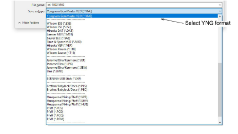

# Send bling to CAMS machine

|              | Use Bling > Show Bling Work Area to visualize the design within the work area of the selected machine model. |
| ------------------------------------------------------------------ | ------------------------------------------------------------------------------------------------------------ |
|  | Use Standard > Send to Connection Manager to connect to supported machines via proprietary machine software. |

EmbroideryStudio supports direct connection to CAMS automatic rhinestone placement machines. A general procedure is outlined below.

Note: Before executing the procedure, it is important that the machine drivers for your CAMS machine be properly installed. They need to be installed and the machine connected before setting up the COM port. Refer to your machine documentation.

## To select bling machine...

1. Select the machine you want to connect to via the Setup > Bling Machine Setup command.

2. In the Model panel, select the machine model you are using.

3. Activate the Bling Work Area to visualize the design within the work area of the selected machine model.

4. Set the color of the work area as desired.

## To send to Connection Manager...

1. From the Standard toolbar, click the Send to Connection Manager button.

2. From the Connection Manager droplist, select ‘CAMS’.

3. Click the Setup button. The CAMS Setup dialog opens.

4. Check the communications port and baud rate settings.

If you are using an ‘old school’ serial connection, the COM port in the software should match the port to which the cable is connected. If you are using a USB connection, the COM port in EmbroideryStudio must match the ‘virtual’ COM port assigned to it. You can find this in Windows Control Panel > Device Manager.

If you are using a USB connection and the COM port is not available for selection in EmbroideryStudio, you need to verify that your hardware drivers have been correctly installed and are up-to-date. Check your machine documentation for details.

The baud rate in EmbroideryStudio must match the baud rate at which the machine was configured to read the data. This is normally 57600 (the system default). However, you can confirm the value when you prepare the machine to receive data. The baud rate will be displayed on the machine console.

The model will default to the machine selected via the Setup > Bling Machine Setup function. You can change it here if required.

5. Click OK. The Send to CAMS Machine dialog opens.

6. Use this dialog to assign bling in the design to the available feeders on the CAMS machine.

7. Prepare the machine to receive data and click the Send button.

Caution: If you try to send something before the machine is ‘Ready’, it may fail to read the next design.

## To export to bling placement file...

- If your placement machine is not directly connected to the PC, use the Export Machine File option to output to Yongnam YNG format. This can loaded onto the machine via memory stick.

## Suggested workflow

The precise workflow you follow will depend on the number of feeders available on the selected machine. For example, if you have a machine with two feeders which is currently set up to feed SS6 on Feeder #1 and SS10 on Feeder #2, and wish to output a design which contains SS6, SS8, SS10, you may do so like this:

- Drag SS6 to Feeder #1.
- Drag SS10 to Feeder #2.
- Prepare the machine for download.
- When the machine is ‘Ready’ for download, click Send.
- When the machine has finished receiving the file, run the machine to place all the SS6 and SS10 stones.
- Once the run is completed on the machine, replace the SS6 feeder on the machine with the SS8 feeder.
- In the software, drag SS8 to Feeder #1 (where you had previously dragged the SS6).
- Prepare the machine for download again.
- When the machine is again ‘Ready’, click Send.
- When the machine has finished receiving the file, run it in order to add the SS8 stones to the design already containing the stones from the previous run.

Depending on the number of bling types used in the design and number of available feeders, you may need to send bling more than once. You will be prompted if you exit before all bling has been sent to machine.

## Related topics...

- [Send designs to Connection Manager](../../Production/output/Send_designs_to_Connection_Manager)
