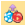
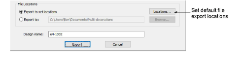
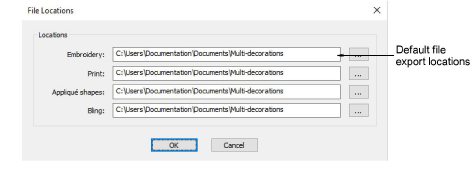
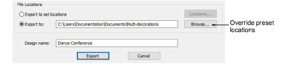

# Set export locations

|  | Use Standard > Export Multi-Decoration Files to export all design components requiring different production processes. |
| ---------------------------------------------------------------------------------- | ---------------------------------------------------------------------------------------------------------------------- |

In some production environments, each file is placed in a specific location where it can be used by the operator of that process. For example, the Tajima Machine Network requires all files to be placed in a specific folder so they can be seen directly by the machine. Similarly, file formats used in any given process do not change unless the process changes – for example, if a machine is replaced. Use the following procedure when you want to set export defaults for the Export Multi-Decoration Files process.

## To set export locations...

1Run the Export Multi-Decoration Files procedure.

2To set or change the default multi-decoration file export settings, click the Locations button.

3Select file locations via the browse (...) button for each design component.

4Click OK to finish.

Once set, your settings are remembered for each successive session.

Tip: Preset locations can be overridden for one-off exports – e.g. to USB stick – by means of the Export to option.

## Related topics...

- [Export design components](Export_design_components)
