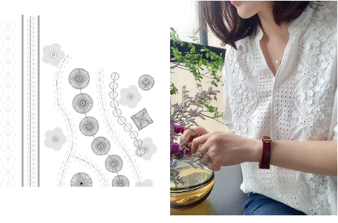

# Boring

Borer embroidery remains a popular technique for cutting holes in fabric to produce an effect similar to lace. If your embroidery machine is equipped with a boring knife or needle, the Borers function is available to turn needle penetrations into boring holes, regardless of selected stitch type. Holes are cut in the fabric, producing an effect similar to lace.

## Related video

<iframe src="https://www.youtube.com/embed/ln4-d1xSchs" frameborder="0" 
		 allow="accelerometer; autoplay; clipboard-write; encrypted-media; gyroscope; picture-in-picture" 
		 allowfullscreen="" style="width: 560px; height: 315px;">

</iframe>

## Related topics

- [Prototype boring](Prototype_boring)
- [Select machine format](Select_machine_format)
- [Digitize boring holes](Digitize_boring_holes)
- [Combine boring with other techniques](Combine_boring_with_other_techniques)
- [Productivity techniques](Productivity_techniques)
- [Boring output](Boring_output)
