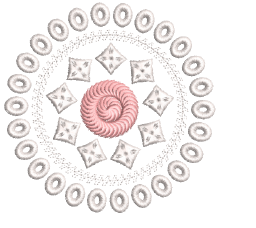
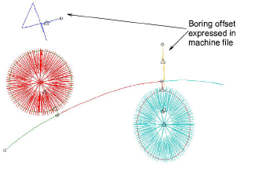

# Boring output

Export the machine file corresponding to your selected machine format:

- Tajima - DST
- Barudan - U??
- SWF - EBD
- Dahao - DST
- Happy - TAP
- ZSK2 - Z??

When exporting to Tajima or Barudan machine file, boring functions are encoded as color changes. These allow the machine to switch to the boring attachment. The machine must be correctly programmed.

In addition to color change codes, the software adds a vertical offset of ±12mm as Jumps wherever it encounters a ‘Borer In’ or ‘Borer Out’ function. These are interpreted on the machine as:

- Borer In: Stop code with -12mm off-set
- Borer Out: Stop code with +12mm offset.

For Tajima DST, the needle bar sequence is set on the control panel by the machine operator. If the needle bar sequence is incorrect, the fabric is ruined. In the Production Worksheet, needle bars are indicated in the color sequence.

## Related topics...

- [Exporting designs for machine](../../Production/output/Exporting_designs_for_machine)
- [Printing design reports](../../Production/reports/Printing_design_reports)
