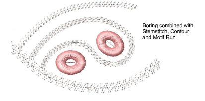
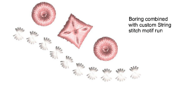
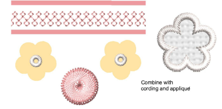

# Combine boring with other techniques

Here are a few tips for combining boring with other embroidery techniques...

- Typically you will want to combine boring holes with other stitch types and effects such as Stemstitch, Contour, and Motif Run.

- String stitch can also be used to good effect with borer designs as custom motif runs.

- If your machine supports it, you can combine boring with cording or tape embroidery. You may also be able to combine borer holes with appliqué objects such as floral motifs.

## Related topics...

- [Contoured fills](../../Decorative/curves/Contoured_fills)
- [Decorative outlines](../../Digitizing/stitches/Decorative_outlines)
- [String stitching](../../Decorative/specialty/String_stitching)
- [Cording](Cording)
- [Creating appliqué embroidery](../applique/Creating_appliqué_embroidery)
