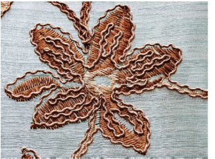

# Cording

Cording refers to the technique of fixing a thick cord or yarn onto a fabric, usually for decorative purposes. Digitizers frequently want to see the cord line so that while they digitize, they don’t overstitch on sharp turns. The Cording function allows you to designate the run stitching which is to form the cording.

## Related topics...

- [Designing for cording](Designing_for_cording)
- [Create cording designs](Create_cording_designs)
