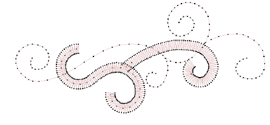
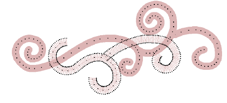
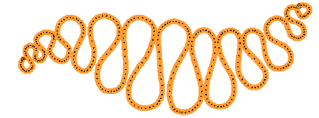
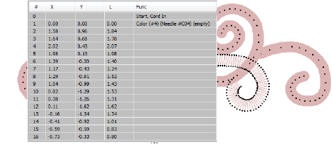

# Create cording designs

|                            | Use Outline Stitch Types > Run to place a row of single run stitches along a digitized line. Right-click for settings. |
| ---------------------------------------------------- | ---------------------------------------------------------------------------------------------------------------------- |
|                    | Use Stitch Effects > Cording to apply the cording effect to new or selected objects with run stitching.                |
|  | Click View > Show Needle Points to show or hide the needle points in embroidery stitching.                             |

To create a cording design in EmbroideryStudio, follow this process:

- Digitize a cording design by digitizing a run with Cording turned on. Any suitable input method can be used together with Run stitch.

- Alternatively, select a run stitch object and apply the Cording effect. The cord is displayed as a graphic line. It takes the color of the run stitching. This allows designers to check technical correctness and better visualize a corded design look.
- Turn on needle points. Adjust display colors as necessary.

- Avoid or minimize jumps/connectors between different cording objects in the design. Don’t use jumps for automatic connectors.
- Avoid or minimize cording crossing over itself.
- It is possible to use some fill stitch methods for cording if you set object properties for open density with no underlay. You can then break apart the object and apply Run together with Cording.

Idea Some machines have a specific cording function which is output when saving to machine file – e.g. Barudan FDR-3 file format or Schiffli machines that support cording. For machines that don’t have an explicit cording function, the software outputs a Stop code.

## Related topics...

- [Viewing design components](../../Basics/view/Viewing_design_components)
- [Change display colors](../../Basics/view/Change_display_colors)
