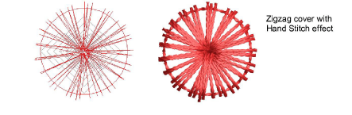

# Digitize boring holes

|  | Use Function > Penetrations together with Borers to digitize boring holes.                 |
| -------------------------------------------- | ------------------------------------------------------------------------------------------ |
|              | Use Function > Borers to activate the boring function.                                     |
|          | Use Traditional Digitizing > Run to digitize an outline around the shape you want to bore. |
|              | Use Traditional Digitizing > Manual to digitize boring holes.                              |
|              | Use Traditional Digitizing > Column A to digitize border stitching around the holes.       |

With Borers selected, each needle penetration becomes a borer cut, regardless of selected stitch type. Boring holes are generally stabilized with zigzag to prevent fraying and movement, and bordered with satin stitches.

Whether you are digitizing for borer knife or needle, the technique is the same.

## To digitize the boring hole...

1. Ensure Penetrations is on.

2. Open the Stitch List to visualize what is happening at the stitch level.

3. Click the Run icon and digitize a stabilizing run around the borer hole. This helps prevent the fabric from tearing.

4. Click the Borers icon. A [machine function](../../glossary/glossary) is inserted to indicate the change from stitching to boring.

5. Using the Run tool, digitize cutting lines. For a round hole, two intersecting lines are sufficient. For an oval hole, digitize a single cutting line.

Diamond shapes represent borer cuts on the fabric. Size indicates depth of cut. They do not appear in TrueView™.

Note: Some digitizers prefer to use the Manual tool. Each stitch you digitize becomes a boring hole. Bear in mind though that holes digitized in this way cannot be scaled.

6. Reduce Run length to 1.0-1.5 mm to place borer penetrations closer together. This ensures a clean cut.

7. Because the boring knife does not require tie-in and tie-off stitches, deactivate these functions via Object Properties > Connectors.

8. Click Borers again to deselect it. This returns you to normal stitching. You now need to stabilize the fabric and create borders by stitching around them with zigzag and satin cover stitches.

## To stabilize the hole...

1. Using Zigzag stitch, digitize around the hole with Column A or, if you have it, the Ring tool.

2. Turn off underlay and adjust stitch length to around 3mm.

3. Place the inside edge close to the hole center so it ‘wraps’ the fabric.

4. In the Stitch List you will see Borer In and Borer Out functions whenever the borer knife is engaged.

## To create cover stitching...

1. Digitize the cover stitching with Column A and Satin. Or, as a shortcut, duplicate the zigzag object and apply satin stitch.

2. Again, ensure underlay is turned off.

3. Use Align Centers to align all objects.

4. Try experimenting with other styles of cover stitching:

- For a more open style, try Zigzag on its own by decreasing stitch spacing to around 1mm.

- For a more organic look, try applying Hand Stitch effect to Zigzag cover stitching.

- Or for denser cover, try Hand Stitch with Satin cover.

- Pagadhi or String stitch may also provide interesting cover for boring holes, both round and square.

- Here we see an experimental square borer hole design. With sharp corners, stitching tends to pull fabric inward. We try to compensate for this by angling corners outwards.

## Related topics...

- [Borer functions](../../Setup/machines/Borer_functions)
- [Filtering stitches & functions](../../Modifying/functions/Filtering_stitches_functions)
- [Digitizing manual stitches](../../Modifying/functions/Digitizing_manual_stitches)
- [Digitizing outlines & details](../../Digitizing/input/Digitizing_outlines_details)
- [Automatic tie-in settings](../../Quality/connectors/Automatic_tie-in_settings)
- [Automatic tie-off settings](../../Quality/connectors/Automatic_tie-off_settings)
- [Stitch length settings](../../Digitizing/stitches/Stitch_length_settings)
- [Digitizing regular columns](../../Digitizing/input/Digitizing_regular_columns)
- [Arranging objects](../../Modifying/transform/Arranging_objects)
