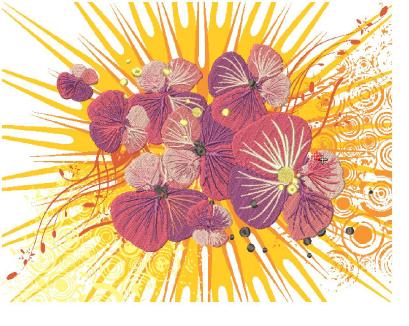

# Mixed Decoration

Once digitized in EmbroideryStudio, you can output designs both as actual embroidery and ‘virtual embroidery’. The software provides high resolution digital print TrueView for this medium.

Virtual embroidery can be printed on garments as is or in combination with graphic design or even embroidery. It may have other uses such as advertising, posters, murals, billboards, etc. All types of substrates can be used. Production processes include:

- Screen printing
- Dye sublimation
- Direct-to-garment printing (DTG)
- Heat transfer
- Wide format printing
- Vinyl cut (printed)

EmbroideryStudio provides support for many other decoration types. Some machines provide devices for cording or beading. The Cording function allows you to designate run stitching which is to form the cording. The Borers tool is available to turn needle penetrations into boring holes, regardless of selected stitch type. Holes are cut in the fabric, producing an effect similar to lace.

This section outlines techniques involved in outputting embroidery as virtual decoration. It covers combining virtual embroidery with print as well as virtual with actual embroidery. It also covers EmbroideryStudio support for cording and boring.

## Related topics...

- [Virtual embroidery](Virtual_embroidery)
- [Cording](Cording)
- [Boring](Boring)
