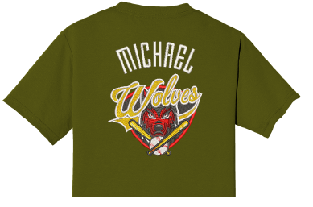
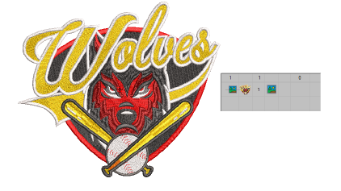
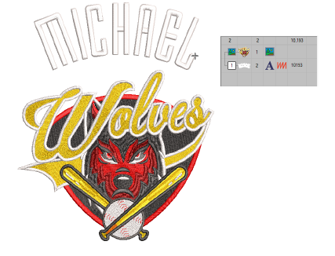
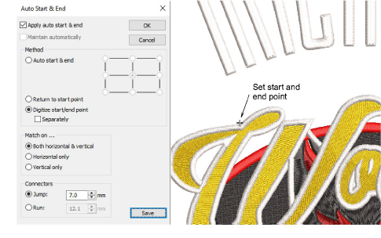
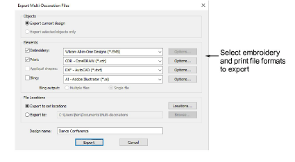
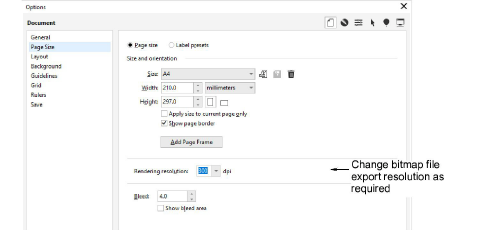

# Output combined virtual & actual embroidery

|                    | Click View > TrueView to toggle between stitch view and TrueView™. Right-click for settings.                                                 |
| ---------------------------------------------------------------- | --------------------------------------------------------------------------------------------------------------------------------------------- |
|                    | Use Standard > Import Graphic to import artwork into current design as a backdrop for manual or automatic digitizing.                         |
|                        | Use View > Show Bitmaps to toggle bitmap images on or off. Right-click for settings.                                                          |
|                | Use View > Auto Start & End to toggle the Auto Start & End function on/off according to the current settings. Right-click to adjust settings. |
|  | Use Mode > CorelDRAW Graphics to import, edit or create vector artwork as a backdrop for embroidery digitizing, manual or automatic.          |

Combining actual and virtual embroidery offers interesting possibilities. This technique can be used artistically or to add texture and depth to a printed design. It may also be used to lower costs for large production runs while maintaining the appearance of actual embroidery.

Typically, you will create a virtual embroidery print of an entire design and then overlay real embroidery on some parts of it. Alternatively, you may add embroidery elements such as lettering or team names over a printed design. It is even possible to embroider the whole design in white thread and print virtual embroidery over the top. To produce a design as real embroidery plus virtual embroidery, you have two options – via Wilcom Workspace or via CorelDRAW Graphics.

## To create combined actual embroidery and print decoration...

- Create a virtual decoration of your embroidery design. See previous.
- Import the PNG file into a new blank design via File > Import Graphic.

- Add the actual embroidery portion of the design. This may be a portion of the original design. Or it may be a new component such as lettering or even Team Names.

- Right-click Auto Start & End.

- Choose Digitize start/end point and click OK. EmbroideryStudio prompts you to click a point where you want the design to start and end.
- Set a point to which you can easily align the needle. When you stitch out the embroidery component, the needle will start and end at this point.

## Option 1: Export both files together

- Select the File > Export Multi-Decoration Files command.

- Split out the embroidery production and graphics print files and select the formats to export – e.g. DST and PNG.

Note: If you choose PNG, it will default to the CorelDRAW default setting of 300 DPI. This can be changed via the CorelDRAW Options dialog.

## Option 2: Export files separately...

- To obtain the embroidery production file, select File > Export Machine File from the Wilcom Workspace and choose a suitable machine file format – e.g. DST.
- To obtain the graphics production file, switch to CorelDRAW Graphics:
- Turn off the embroidery display.
- Select File > Export > PNG to export the print file for graphics only.

## Related topics...

- [Output embroidery as virtual decoration](Output_embroidery_as_virtual_decoration)
- [Viewing design components](../../Basics/view/Viewing_design_components)
- [View options](../../Setup/settings/View_options)
- [Creating simple teamname designs](../../Lettering/lettering_names/Creating_simple_teamname_designs)
- [Fabric & product backgrounds](../../Digitizing/colorways/Fabric_product_backgrounds)
- [Exporting multiple decoration files](../export/Exporting_multiple_decoration_files)
