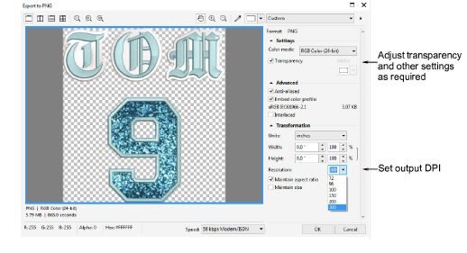

# Output combined virtual embroidery & print

|          | Click View > TrueView to toggle between stitch view and TrueView™. Right-click for settings.                                        |
| ------------------------------------------------------ | ------------------------------------------------------------------------------------------------------------------------------------ |
|    | Click View > Show Product to toggle product image on/off. Right-click to open the Product Visualizer docker.                         |
|  | Use Mode > CorelDRAW Graphics to import, edit or create vector artwork as a backdrop for embroidery digitizing, manual or automatic. |
|        | In Graphics mode, click Mode > Show Embroidery to show or hide embroidery components.                                                |

To produce a combined embroidery decoration plus graphics, use the following procedure. Don’t use the Export Multi-Decoration Files command for this scenario as it doesn’t support virtual embroidery as print.

## To create combined virtual embroidery and print decoration...

- Open your EMB design file.
- Optionally, turn on TrueView™ to visualize the embroidery component. Use Options > View Design to make any adjustments to TrueView™ settings.
- Toggle on any graphic elements – bitmap or vector.
- Optionally, toggle on the product image to visualize the resulting virtual decoration on the target garment. Make any size adjustments needed.

## To output the virtual decoration...

- Switch to CorelDRAW Graphics.
- In Graphics mode, click Show Embroidery to toggle on the embroidery component.

- Select a bitmap resolution – e.g. 300 DPI – from the Mode toolbar. You can override presets by keying in a higher resolution as required – e.g. 1200 DPI. Width and height settings update automatically.

Tip: This setting determines the detail at which the TrueView™ image will be rendered. Maximum DPI for printers can vary between 600 and 2880 DPI. For general purposes such as printing on T shirts, good results can be obtained within a range of 200 to 400 DPI. Higher resolutions may be necessary for other substrates or media.

- Select File > Export > PNG to export a high resolution file for printing or similar.

- Click Export. The Export to PNG dialog opens.

- Adjust transparency, anti-aliasing, and DPI settings as required. The DPI setting in this dialog does not affect the DPI resolution of the TrueView™ rendering. It only affects the DPI of the actual output file. Normally you would want to set the TrueView™ rendering and output resolution to be the same value. You can override presets by keying in a higher resolution as required – e.g. 1200 DPI.
- Click OK to export.

## Related topics...

- [Viewing design components](../../Basics/view/Viewing_design_components)
- [View options](../../Setup/settings/View_options)
- [Fabric & product backgrounds](../../Digitizing/colorways/Fabric_product_backgrounds)
