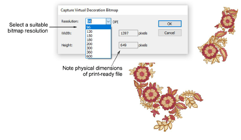
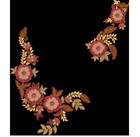

# Output embroidery as virtual decoration

|        | Click View > TrueView to toggle between stitch view and TrueView™. Right-click for settings.                |
| ------------------------------------------ | ------------------------------------------------------------------------------------------------------------ |
|  | Click View > Show Product to toggle product image on/off. Right-click to open the Product Visualizer docker. |

If all you want to do is output the embroidery portion of a design as a high resolution virtual decoration, the process is simple.

## To output virtual embroidery decoration...

- Open your EMB design file.
- Optionally, turn on TrueView™ to visualize the embroidery component. The image produced is always in TrueView™ even if the TrueView setting is off. The Options > View Design settings will affect the final appearance of the virtual embroidery. You may want to adjust these.
- Optionally, toggle on the product image to visualize the resulting virtual decoration on the target garment. Make any size adjustments needed.
- Select File > Capture Virtual Decoration Bitmap.

- Select a suitable resolution – e.g. 300 DPI. This setting determines the detail at which the TrueView™ image will be rendered. You can override presets by keying in a higher resolution as required – e.g. 1200 DPI. Width and height settings update automatically.
- Click OK to save a PNG file of the design. Only the embroidery portion of the design is output to PNG file. This file can now be printed to garment or other media.

::: info Note
For the purposes of virtual decoration, sequins and bling can be included in the output.
:::

## Related topics...

- [Viewing design components](../../Basics/view/Viewing_design_components)
- [View options](../../Setup/settings/View_options)
- [Fabric & product backgrounds](../../Digitizing/colorways/Fabric_product_backgrounds)
