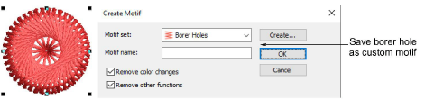
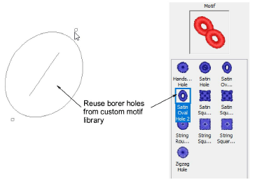
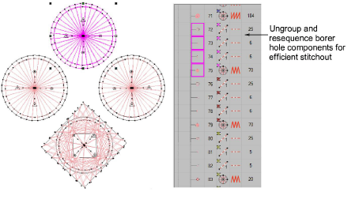

# Productivity techniques

Here are a few tips for getting more out of your boring holes...

## Recycling boring holes

Once you have designed and tested boring holes that work, you can save them as custom motifs for re-use. Make sure Remove other functions is turned off to preserve cutting lines.

Once you have set up a library of borer holes, these are available for use with the Use Motif tool. The advantage of this technique is that boring holes can be easily scaled and rotated into position. Check, however, that scaling does not affect the ratio of knife cut to zigzag and cover stitching.

## Resequencing boring holes for production

When it comes to actual production, borer holes are usually cut in groups for faster production. The components need to be sequenced for borer cuts to occur in neat, close groupings. Since individual motifs appear as grouped objects, ungroup them and resequence components as needed.

Of course by cutting first and then applying tackdown and cover stitching, you risk registration errors. You need to decide between quality vs productivity. For large production runs, productivity is a high priority and constrained by production cost.

Caution: Depending on production type, you will again need to test the design sequence carefully before starting a production run.

## Related topics...

- [Custom motifs](../../Decorative/motifs/Custom_motifs)
- [Sequencing embroidery objects](../../Modifying/combine/Sequencing_embroidery_objects)
