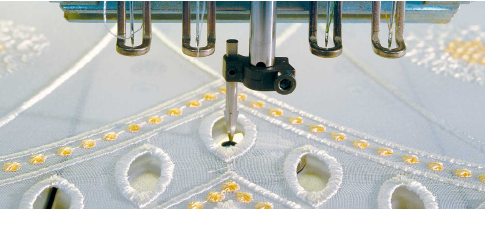

# Prototype boring

Borer digitizing is a difficult skill to master. You will need to experiment with your machine and stitch width and spacing settings to achieve reliable results. Bear in mind that before putting any boring into production, everything needs to be carefully stitch tested, edited, and tested again. It all depends on the effect you want to achieve and the machine you are using.

Of critical importance are the following considerations:

| Fabric type  | How to achieve the same look with different fabrics? Typically, stitches and borer cuts will be slightly different. |
| ------------ | ------------------------------------------------------------------------------------------------------------------- |
| Hole shape   | Which cutting technique to use for circle, oval, square, etc?                                                       |
| Borer cut    | How big should the cut be and how many penetrations are necessary?                                                  |
| Cover stitch | How wide and how dense does the covering need to be?                                                                |

::: info Note
This topic provides advice on how to approach boring with EmbroideryStudio. Without stitch testing however, we only can provide the theory.
:::
