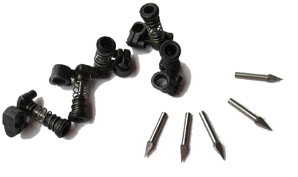
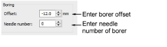

# Select machine format

Borers are often ‘knife’ attachments which are offset from the main needle. Before boring starts, the frame moves so that the borer is in the correct position. This movement compensates for the borer offset.

Check your machine user guide. If it is capable of boring, you may add a borer knife or needle and activate the borer function. For older Tajima models, there is a ‘Borer’ dip switch in the control panel. For newer models, there is a ‘Borer’ function among the machine settings.

Here is a standard Tajima borer set. The borer knife is mounted inside the rubber tube, and the borer set is mounted on the needle bar. On the machine, there is a hole filled with a small rubber mat to buffer the borer.

Select the format for the target machine you are using. For instance, Tajima, Barudan, SWF, Dahao, Happy, ZSK2\. The needle position of the borer and its offset value are specified in the Machine Format Settings dialog as part of the machine format definition.

The [default setting](../../glossary/glossary) for Tajima and Dahao formats is for a ‘knife’ attachment, where the cutting position is offset ±12 mm from the main needle line. This offset is only expressed when you save your design to a stitch format like DST.

If you are using a boring needle instead of a knife, no offset is required. Some machines automatically adjust the offset when a Borer In function is encountered. These require a value of ‘0’. This too should be part of the machine format definition, but you may need to adjust it manually. See your machine manual for details.

::: info Note
With Tajima and Barudan machines the Borers function inserts a Stop which allows the machine to change to the needle position that uses the boring attachment. The machine must be correctly programmed to use the correct needle position.
:::

## Related topics...

- [Machine Formats](../../Setup/machines/Machine_Formats)
- [Borer functions](../../Setup/machines/Borer_functions)
- [Custom machine formats](../../Setup/machines/Custom_machine_formats)
