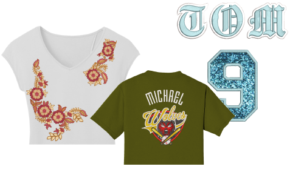

# Virtual embroidery

EmbroideryStudio provides high resolution TrueView for ‘virtual embroidery’. This is a technique that can provide commercial flexibility for many different processes.

Image resolution depends on a specified DPI (Dots Per Inch). Maximum DPI for printers varies between 600 and 2880 DPI. For garments, good results can be obtained within a range of 200 to 400 DPI. Higher resolutions are available for printing on paper, photo paper, canvas, fabrics, glass, mugs, plaques, wood, metal, etc.

Screen images are typically captured in PNG format because this supports transparency. Most DTG printers and other printing techniques use RIP (Raster Image Processor) software which can use any raster image that supports transparency, including PNG format. Output files can be used as is or as input to any graphic or photo editing software.

## Related topics...

- [Output embroidery as virtual decoration](Output_embroidery_as_virtual_decoration)
- [Output combined virtual embroidery & print](Output_combined_virtual_embroidery_print)
- [Output combined virtual & actual embroidery](Output_combined_virtual_actual_embroidery)
