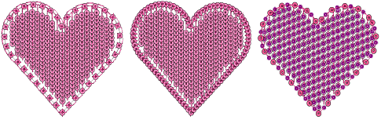
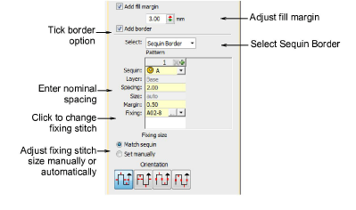
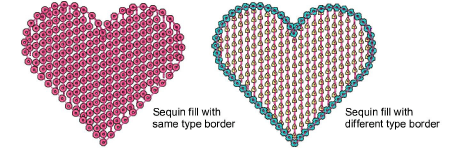
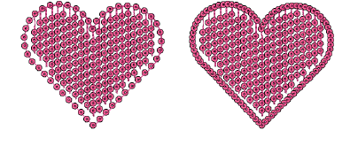
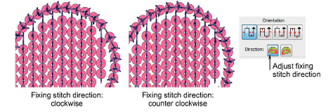

# Adding sequin borders

Sequin fills can include a border, with or without a margin. The border is a property of the object. If a twin-sequin capable machine is selected, the border and fill can differ. They can be comprised of single sequins or sequin patterns.

## To add a sequin border...

- Select a sequin-fill object and double-click to access object properties.

- Tick the Add Border checkbox and select Sequin Border from the droplist.
- Adjust sequin shape as shown. This can be the same or different to the sequin fill if you have a twin-sequin capable machine.

- Adjust the fill margin and border spacing as shown.

- Set sequin border fixing stitch direction as shown.

## Related topics...

- [Digitizing sequin runs](../sequin_basics/Digitizing_sequin_runs)
- [Sequin fixings](../sequin_basics/Sequin_fixings)
