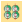
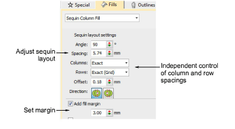
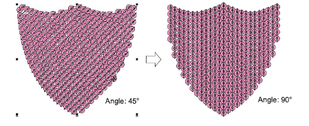
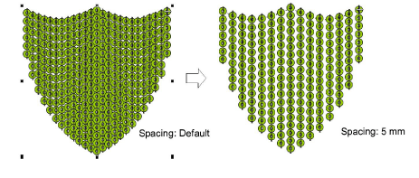
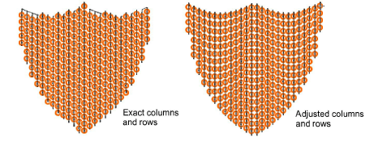
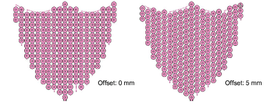
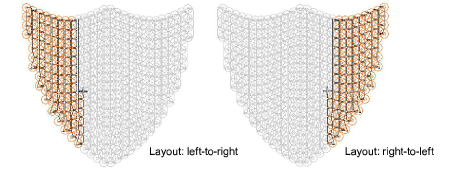
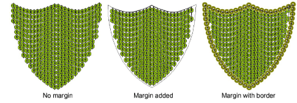

# Adjust sequin layouts

|  | Use Sequin > Sequin Fill to digitize and fill large, irregular shapes with sequins. |
| -------------------------------------------------- | ----------------------------------------------------------------------------------- |

Use sequin layout settings to control the overall layout of the fill grid, including angle, sequin spacings, and offsets within the grid.

Sequin Fill provides independent control of column and row spacings. Set the nominal spacing in the Spacing field. You have the option of expanding or contracting spacings in rows or columns. Each line is adjusted independently. The aim is to make sequins follow to the edge of the shape as closely as possible. This is less important if you add a border to the fill.

## To adjust sequin layouts...

- Adjust Angle as shown:

- Adjust Spacing as shown. This setting controls column spacing, not row spacing.

- Use Columns and Rows settings to make sequins fit the grid or adjust line-by-line to fit the shape. This is less important if you add a border to the fill.

- Adjust Offset as shown. This only works if you have set Rows to ‘exact’ spacing.

- Adjust Direction as shown. This does not affect sequin layout, but it does affect stitching order, whether left-to-right or right-to-left. It may affect the appearance of fixing stitches.

- Activate Add Fill Margin and adjust setting as necessary. This is generally used in conjunction with the Add border option. See below.

