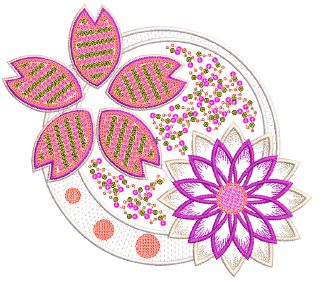

# Advanced Sequins

Some embroidery machines are equipped with devices that can drop sequins onto the garment as it stitches. Machine capabilities vary widely. Some machines only support single-sequin devices. Some machines support twin-sequin devices. Newer machines can support multi-sequin devices. These may perform consecutive sequin feeds – one at a time whilst stitching. Some may allow ‘stack feeding’, where multiple sequins are dropped and secured with a single fixing stitch.

This section describes how create sequin fills, both single- and multi-sequin, with and without borders. It discusses fancy sequin fills as well as flip sequins. It also covers editing sequin fills and converting objects to sequins. It deals with single sequin digitizing and custom sequins as well as outputting sequin designs.

## Related topics...

- [Creating sequin fills](Creating_sequin_fills)
- [Adding sequin borders](Adding_sequin_borders)
- [Special sequin fills](Special_sequin_fills)
- [Creating multi-sequin fills](Creating_multi-sequin_fills)
- [Editing sequin fills](Editing_sequin_fills)
- [Converting objects to sequins](Converting_objects_to_sequins)
- [Manual sequin digitizing](Manual_sequin_digitizing)
- [Custom sequins](Custom_sequins)
- [Outputting sequin designs](Outputting_sequin_designs)
