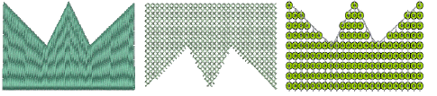

# Convert embroidery objects to sequins

|      | Use Sequin > Sequin Run Auto to create a string of sequins along a digitized line according to current settings. |
| -------------------------------------------------- | ---------------------------------------------------------------------------------------------------------------- |
|  | Use Sequin > Sequin Fill to digitize and fill large, irregular shapes with sequins.                              |

Convert any open object – Run, Stemstitch, Motif Run, Freehand, Column C, Vector – to sequin run.

Right-click and select Convert > Convert to Sequin Run. Alternatively, simply click the Sequin Run Auto icon.

Similarly, convert any closed object – Column A/B, Complex Turning, or Complex – to sequin fill.

Right-click and select Convert > Convert to Sequin Fill. Or click the Sequin Fill icon.

