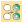
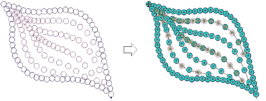
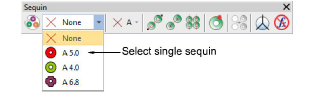
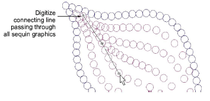
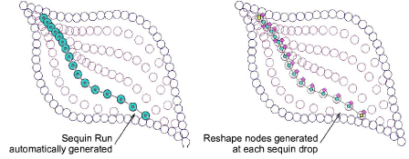
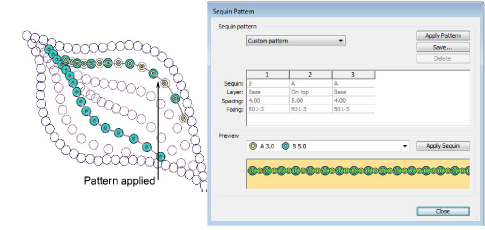

# Convert sequin artwork

|  | Use Sequin > Vectors to Sequins to create a sequin run from a set of sequin vector objects selected by intersecting line. |
| ---------------------------------------------------- | ------------------------------------------------------------------------------------------------------------------------- |

Frequently, artwork for sequin designs is independently created by a specialist designer and supplied to the embroidery digitizer as a vector file. The Vectors to Sequins tool is available for just this purpose. A sequin run is automatically created from a set of vector objects representing sequins. Fixing stitches are generated automatically according to current settings. If you are digitizing twin-sequin runs, EmbroideryStudio will generate sequin drops according to the currently selected sequin run pattern.

## To convert sequin artwork...

1Select a machine format that supports sequin mode via the Select Machine Format dialog.

2Insert the sequin artwork into the design.

Properly designed artwork will contain vector objects centered on the exact locations required for sequins in the design.

3Select the sequin shape you want to use from the droplist in the Sequin Palette.

4Select the Vectors to Sequins icon.

5Click the sequin graphic which will start the sequin run.

6Digitize a line connecting all sequins to be included in the sequin run.

The line only needs to touch the sequin object somewhere within its boundary. Left-click for corner points, right-click for curve points.

7Press Enter.

A sequin run is generated along a curve that passes through the center of each sequin graphic with sequin objects positioned at these centers. Current properties are applied and the object is set to ‘manual’ by default. The generated curve contains a reshape node at each sequin position.

Tip: If you are running twin-sequin mode and preset a sequin pattern in Object Properties, this pattern is applied to the converted sequin objects while sequin spacing is preserved as per the artwork.

## Related topics...

- [Select sequin-capable machines](../sequin_basics/Select_sequin-capable_machines)
- [Creating multi-sequin runs](../sequin_basics/Creating_multi-sequin_runs)
