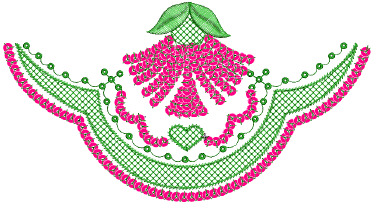

# Converting objects to sequins

Most objects in EmbroideryStudio are inter-convertible. Open and closed sequin objects are no exception. Any open object – Run, Stemstitch, Motif Run, Freehand, Column C, Vector – can be quickly converted to sequin run. Similarly, any closed object – Column A/B, Complex Turning, or Complex – can be converted to sequin fill. EmbroideryStudio also provides a dedicated tool for automatically converting sequin artwork in the form of a vector file to sequin runs.

## Related topics...

- [Convert embroidery objects to sequins](Convert_embroidery_objects_to_sequins)
- [Convert sequin artwork](Convert_sequin_artwork)
