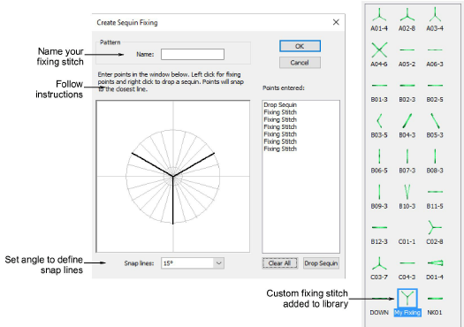
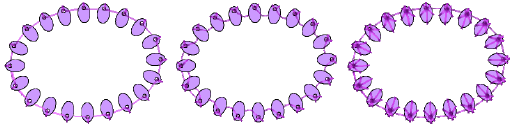

# Create sequin fixings

Just as you can define custom sequin shapes, you can define custom fixing stitches to support multi-head sequin devices. Some limitations might exist for older more complicated sequin devices. Access the dialog via the Object > Create Sequin Fixing command.

Custom sequin fixings mean you can:

- Create multiple layers of stitching for decorative effects, sometimes in different thread colors (Barudan).
- Reduce stitch counts in large sequin designs.
- Accommodate specific fixing requirements.
- Accommodate new capabilities – e.g. offset holes.

::: tip
If you have chosen an eccentric sequin shape such as an ‘ellipse’, fixing stitches automatically adapt to fit.
:::

::: tip
Use the Setup > Manage Sequin Fixing command to rename or delete custom sequin fixings from the library.
:::
