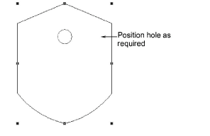
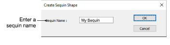
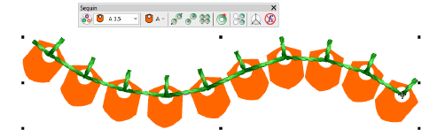
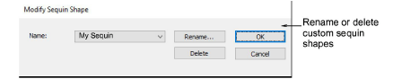

# Create sequin shapes

|              | Use Graphics Digitizing &gt; Ellipse to digitize ellipse or circle vector outlines.                                                                                |
| ---------------------------------------------- | ------------------------------------------------------------------------------------------------------------------------------------------------------------------ |
|      | Use Graphics Digitizing &gt; Basic Shapes to digitize basic shapes. Press &lt;Ctrl&gt; to maintain aspect ratio. Press &lt;Shift&gt; to center at the first point. |
|  | Use Outline Stitch Types &gt; Vector Outline to create vector outlines with no stitch properties applying.                                                         |

The software allows you to define your own sequin shapes with their own hole position.

## To create a custom sequin...

1. Create a sequin shape using vectors only. The Ellipse or even Basic Shapes tools can be useful. Outline and hole must be digitized as separate objects.

2. Position the hole.

3. Size the sequin shape to a nominal size – e.g. 1.5mm.

4. Select both objects and choose Object &gt; Create Sequin Shape.

5Give your sequin a name and click OK to save. The custom shape is available from the sequin droplist for use in sequin palettes. Use it in sequin runs or fills.

Tip: Use the Setup > Manage Sequin Shape command to rename or delete custom sequin shapes from the library.

## Related topics...

- [Create vectors](../../Automatic/vectors/Create_vectors)
- [Digitize stars & rings](../../Modifying/productivity/Digitize_stars_rings)
- [Digitize basic shapes](../../Modifying/productivity/Digitize_basic_shapes)
- [Manage custom motifs](../../Decorative/motifs/Manage_custom_motifs)
