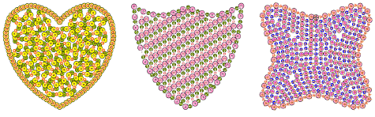
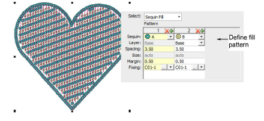
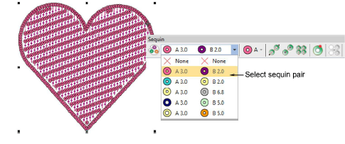
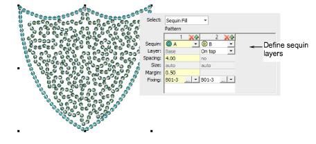
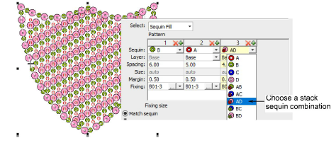
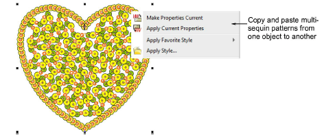

# Creating multi-sequin fills

|  | Use Docker > Object Properties to toggle the docker on/off. Set properties for the current design. |
| ---------------------------------------------------- | -------------------------------------------------------------------------------------------------- |

If you have a twin- or multi-sequin capable machine, you can use the Pattern control to create patterned borders and/or fills. Use it also to control sequin spacing independently of line spacing. Most controls work the same as for Sequin Run. The process is essentially the same as for multi-sequin run patterns, except that you can’t save them for later use.

Tip: Twin-sequin mode also allows you to convert vector objects to twin-sequin outlines. [See also Convert sequin artwork.](Convert_sequin_artwork)

## To create multi-sequin fill patterns...

- Open Object Properties and define a fill pattern as you would for a sequin run.

- Change sequin combinations as desired.

- If your machine format allows it, define sequin layers as you would for a sequin run, one sequin serving as the ‘base’, and the other dropped ‘on top’.

- With Dahao format, choose sequin stacks from the combinations in the droplist.

Note: If you choose a stacked sequin configuration that the sequin device does not support, the machine will simply ignore that particular drop code.

- Optionally, make a selected object’s properties current, including multi-sequin patterns, and apply them to existing objects.

## Related topics...

- [Creating multi-sequin runs](../sequin_basics/Creating_multi-sequin_runs)
- [Sequin fixings](../sequin_basics/Sequin_fixings)
