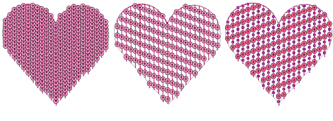

# Creating sequin fills

The Sequin Fill feature provides a means of filling complex shapes with sequins generally arranged in columns. The fill can also include a border, with or without a margin. This can be made from the same or a different sequin and is a property of the object.

Sequin fills are tied together by run stitches and travel runs. Travels are placed along the object outline. Sequin centers never fall outside the object outline. Sequin fixing stitches, however, can lie outside the outline depending on current settings.

Tip: The Show Repeats function displays repeating designs, including sequins, in both TrueView and stitch view. You can view a design, even while digitizing, with any number of repeats. [See also Viewing design repeats.](../../Basics/view/Viewing_design_repeats)

## Related topics...

- [Digitize sequin fills](Digitize_sequin_fills)
- [Adjust sequin layouts](Adjust_sequin_layouts)
