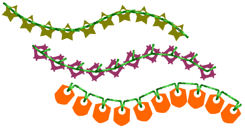

# Custom sequins

EmbroideryStudio supports custom sequin shapes with offset holes. Such sequin shapes can be utilized for flipping sequins on the fabric to form two different sequin fill patterns. Alternatively, you may be working with sequins which don’t appear in the standard sequin library. Define your own sequins using circle, oval, rectangle, or other shapes.

## Related topics...

- [Create sequin shapes](Create_sequin_shapes)
- [Create sequin fixings](Create_sequin_fixings)
