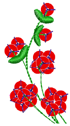
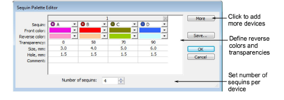
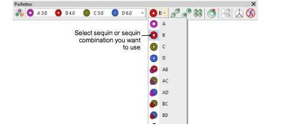
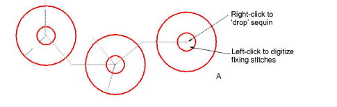
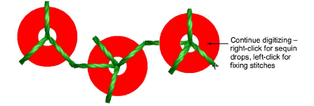
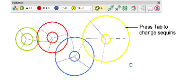
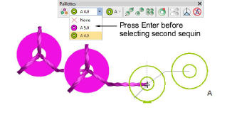

# Digitize sequin drops with fixings

|  | Use Sequin > Manual Sequin to digitize individual sequins. |
| -------------------------------------------- | ---------------------------------------------------------- |

The Manual Sequin input method allows you individual control over sequin placement and fixing stitches. Create decorative outlines and patterns manually using sequins from the selection list. To add a sequin to the stitching sequence, simply drop it onto the design and secure it with manual stitches. Manual sequin stitching is a difficult digitizing skill to master and you need to plan the stitching sequence carefully in order to minimize unnecessary stitches. Experiment with your machine and stitch length and spacing settings to achieve the desired result.

::: info Note
Sequin mode is supported in Schiffli, Tajima, Barudan and ZSK embroidery [machine formats](../../glossary/glossary). Before you can use Sequin mode, you must select a machine format that supports it. Similarly, before you can use Twin-Sequin mode, you must select a suitable machine format.
:::

## To digitize sequin drops with fixing stitches...

- Select a machine format that supports sequin mode via the Select Machine Format dialog.
- Set up your palette in the Sequin Palette Editor according to the machine type – single, twin, multi-sequin – that you have selected.

- Select a color for the fixing stitching from the Color toolbar.
- Click the Manual Sequin icon. If your machine format supports it, stack sequin permutations are displayed in the droplist.

- Select the sequin or combination you want to use.
- Left-click to begin your manual sequin placement. It must start with at least one stitch.

::: tip
Zoom in for more accurate digitizing.
:::

- Right-click to drop a sequin. A sequin outline appears.

- Left-click to digitize fixing stitches around the sequin to secure it.

Three stitches in the shape of a ‘Y’ are generally used. The needle points of each stitch must be placed precisely to ensure that sequins are not pierced by the needle when stitching.

::: tip
If you make a mistake while digitizing, press Backspace to retrace your steps.
:::

- If you have activated twin- or multi-sequin mode, press the Tab key to switch between available sequin shapes while digitizing.

- If you have set up a palette for a machine with two single-sequin devices, you need to press Enter before changing sequins in the palette droplist.

- Continue digitizing manually in the same way – right-click to add a sequin, left-click to digitize fixing stitches. Press Enter to finish.

## Related topics...

- [Select sequin-capable machines](../sequin_basics/Select_sequin-capable_machines)
- [Setting up sequin palettes](../sequin_basics/Setting_up_sequin_palettes)
- [Creating multi-sequin runs](../sequin_basics/Creating_multi-sequin_runs)
