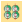
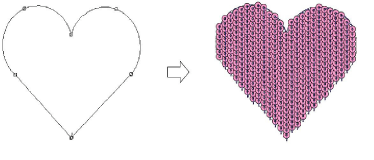
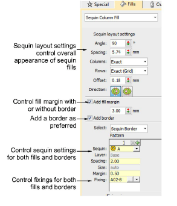
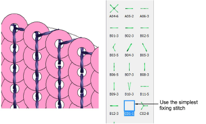

# Digitize sequin fills

|  | Use Sequin > Sequin Fill to digitize and fill large, irregular shapes with sequins. |
| ---------------------------------------- | ----------------------------------------------------------------------------------- |

Before you can use the Sequin tools, you need to choose a suitable machine format. Similarly, you need to prepare a palette of sequins according to capabilities of your chosen machine. [See Selecting sequin mode for details.](../sequin_basics/Selecting_sequin_mode)

Once set up, the palette is available for use from the Sequin toolbar and Object Properties. Digitizing sequin-fill objects is essentially the same as digitizing complex fill objects.

Double-clicking the object will invoke Object Properties similar to sequin run properties. [See Digitizing sequin runs for details.](../sequin_basics/Digitizing_sequin_runs)

Controls available on the Fills > Sequin Column Fill tab for patterns and fixing stitches are summarized below.

| Control                | Description                                                                                                                                                                                                              |
| ---------------------- | ------------------------------------------------------------------------------------------------------------------------------------------------------------------------------------------------------------------------ |
| Sequin layout settings | Use these settings to control the overall layout of the fill grid, including angle, sequin spacings, and offsets within the grid. [See Adjust sequin layouts for details.](Adjust_sequin_layouts)                        |
| Fill margin            | Include a fill margin or not as required. No sequin will have its center placed outside the fill margin. Usually used with a border but not necessarily. [See Adjust sequin layouts for details.](Adjust_sequin_layouts) |
| Add border             | Sequin fills can include a border, with or without a margin. The border is a property of the object. [See Fancy sequin fills for details.](Fancy_sequin_fills)                                                           |
| Select                 | Determines what patterns are displayed: Sequin Fill: displays the fill pattern Sequin Run: displays the border pattern. All other controls work the same as for Sequin Run.                                              |

Fixing stitches are selected in the same way as for sequin runs. For sequin fills, we recommend the simplest fixing stitch available – C01-1.

## Related topics...

- [Selecting sequin mode](../sequin_basics/Selecting_sequin_mode)
- [Digitizing sequin runs](../sequin_basics/Digitizing_sequin_runs)
- [Sequin fixings](../sequin_basics/Sequin_fixings)
- [Creating free-form shapes](../../Digitizing/input/Creating_free-form_shapes)
