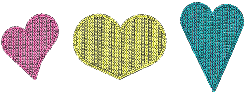
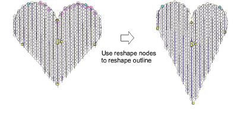
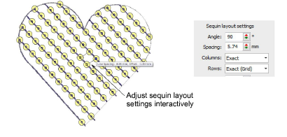
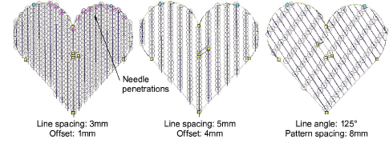
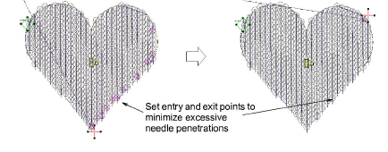
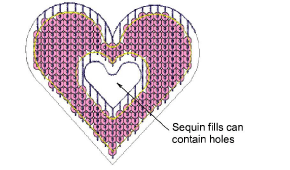

# Editing sequin fills

|  | Use Reshape > Reshape Object to reshape selected objects by means of control points. |
| ---------------------------------------------- | ------------------------------------------------------------------------------------ |
|        | Use Sequin > Sequin Edit to fine-tune placement of individual sequins.               |

Either by means of object properties or the Reshape Object tool, you can control the overall shape of sequin fills as well as their layout. You can also set entry and exit points to avoid excessive needle penetrations.

## To reshape and edit a sequin fill...

- Select a sequin-fill object and click the Reshape icon.

- Adjust overall shape like any embroidery object.
- Use the three central control points to adjust sequin layout settings interactively. These control Direction Angle, Spacing, and Offset settings. Pattern spacing is also influenced.

Pattern spacing is also controlled numerically via the Patterns panel.

- Adjustments can cause needle penetrations to occur within sequins. Affected sequins are highlighted in pink. Adjust layout and/or entry/exit points to minimize unwanted needle penetrations.

- Fine-tune individual sequin spacings with the Sequin Edit tool – click-and-drag a diamond [control point](../../glossary/glossary).
- Holes can be digitized in sequin-fill objects in the same way as any free shape.

## Related topics...

- [Reshaping embroidery objects](../../Modifying/reshape/Reshaping_embroidery_objects)
- [Editing sequin runs](../sequin_basics/Editing_sequin_runs)
- [Creating free-form shapes](../../Digitizing/input/Creating_free-form_shapes)
