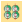
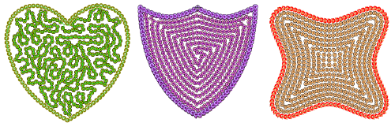
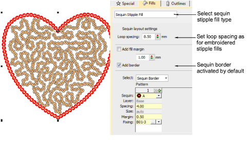
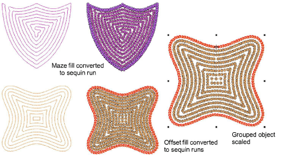

# Fancy sequin fills

|  | Use Sequin > Sequin Fill to digitize and fill large, irregular shapes with sequins. |
| -------------------------------------------------- | ----------------------------------------------------------------------------------- |

EmbroideryStudio allows you to create fancy sequin fills by a variety of methods.

Create variegated stipple fills automatically with single or multi-color sequin patterns. These objects are fully scalable and can be reshaped like any embroidery object. For stipple fills, sequin borders are activated by default.

You can create other fancy sequin fills by the conversion method. This is technically a ‘workaround’ since it does not produce a scalable sequin object. However, if your design requires it, you can first create the desired shape using, for example, Maze or Offset fill. Set spacing sufficient to accommodate the sequins you want to use. Then break apart and convert the resulting run objects to sequin runs. These can be grouped. But note what happens when you scale the object – sequins are recalculated for each run, but the gap between lines increases.

## Related topics...

- [Convert objects with Wilcom Workspace](../../Automatic/automatic/Convert_objects_with_Wilcom_Workspace)
- [Break apart composite objects](../../Modifying/reshape/Break_apart_composite_objects)
- [Stippling effects](../../Decorative/specialty/Stippling_effects)
- [Maze fills](../../Decorative/specialty/Maze_fills)
- [Offset fills](../../Decorative/curves/Offset_fills)
