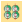
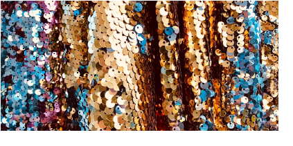
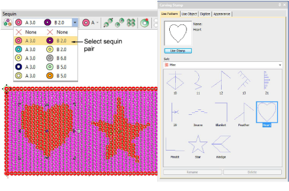
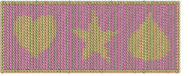

# Flip sequins

|      | Use View > Show Functions to toggle display of machine function symbols. Right-click for settings.                                                                   |
| -------------------------------------------------- | -------------------------------------------------------------------------------------------------------------------------------------------------------------------- |
|        | Use View > Show Stitches to toggle embroidery stitching display. Right-click for settings.                                                                           |
|  | Use Sequin > Sequin Fill to digitize and fill large, irregular shapes with sequins.                                                                                  |
|        | Use Docker > Carving Stamp to define a pattern of needle penetrations using a ‘carving stamp’ as a template.                                                         |
|          | Use View > Flip Sequins to toggle between front and reverse sides of sequin runs and fills in reversible sequin designs. Define colors in the Sequin Palette Editor. |

Flip sequins, also known as reversible sequins, create a color-changing effect which is very fashionable. Beginning with children’s wear, flip sequins have found a wide variety of applications, from reversible sequin shirts, pillow cases, bags, cases, note books, and more. Their use is simple – swipe up or down to reveal the reverse side with sometimes surprising effects. Flip sequins have also found their way into high fashion.

Sequin Fill can be used in combination with Carving Stamp to digitize twin-sequin fills with predefined twin sequin assignments. The stamp pattern takes the color of the other sequin in the currently selected pair. Use the Reshape tool to size, rotate and reshape stamp patterns.

If you have defined reversible or ‘flip’ sequins, click the Flip Sequin control to view the reverse image as it will appear on stitchout.

## Related topics...

- [Setting up sequin palettes](../sequin_basics/Setting_up_sequin_palettes)
- [Creating patterns with carving stamps](../../Decorative/patterns/Creating_patterns_with_carving_stamps)
