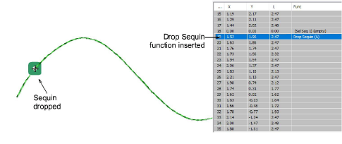

# Insert sequin drops

|                        | Use Outline > Digitize Run to place a row of single or triple run stitches along a digitized line.                                                                        |
| ------------------------------------------------ | ------------------------------------------------------------------------------------------------------------------------------------------------------------------------- |
|            |                                                                                                                                                                           |
|              | Use Outline Stitch Types > Motif Run to create a string of motifs along a digitized line.                                                                                 |
|          | Use Docker > Stitch List to toggle Stitch List display on and off. Use it to select individual stitches.                                                                  |
|    | Use Travel > Travel 1 Stitch to move stitch cursor forwards/backwards 1 stitch at a time. Left/right click.                                                               |
|          | Use Sequin > Drop Sequin to drop a sequin at the current needle position. For twin-sequin machines, left-click to drop a left-sequin, right-click to drop a right-sequin. |
|  | Click Function > Insert Function to insert machine function at current stitch cursor position.                                                                            |
|    | Use Sequin > Clear Function to remove any sequin functions from the current needle position.                                                                              |
|            | Use Traditional Digitizing > Backtrack to reinforce an outline, stitching it in the reverse direction to the original.                                                    |

In preference to the Manual Sequin tool, some digitizers flesh out designs using Run or Triple Run or even Motif Run and then travel through it, dropping sequins manually as and where required. The running stitch itself works as fixing stitch. It can be reinforced with Backtrack. This technique can be used with single or multi-sequins.

## To insert sequin drops...

1. Select a machine format that supports sequin mode via the Select Machine Format dialog.

2. Set up your sequin palette – single, twin, quad, etc – according to machine capabilities.

3. Set a fixed run length to suit the sequin type/s you are using.

4. Choose a digitizing method to create the design or pattern you want.

5. Optionally, open the Stitch List.

6. Press the Home button and travel through the design using arrow keys or Travel tools.

7. Travel to the insertion point and press the ‘hotkey’ 5. Alternatively, click the Drop Sequin button.

8. If you are using a twin-sequin palette, press the hotkey 6 to drop the other sequin. Alternatively, right-click the Drop Sequin button.

9. If you are using a multi-sequin palette, select Insert Function from the toolbar or the Stitch List popup menu.

10. From the Functions list, select Drop Sequin. Depending on machine requirements, you will either add the function to the current stitch, or insert it on an [empty stitch](../../glossary/glossary) or [empty jump](../../glossary/glossary). See your machine manual for details.

11. When the Drop Sequin function is correctly defined, click OK. The Select Sequin dialog opens showing available sequins.

1. 2 [Drop Sequin function, together with any additional empty stitches or jumps, is added at the current needle position.](../../glossary/glossary)

2. Continue traveling and inserting sequins by the same methods.

14. To delete a sequin drop, travel to the location and press 4. Alternatively, click the Clear Sequin button.

Tip: If you are using Triple Run, the repeat stitch will tack down your sequin drop. If you are using Single Run, you can use the Backtrack tool to tack down the sequin drops.

## Related topics...

- [Select sequin-capable machines](../sequin_basics/Select_sequin-capable_machines)
- [Travel through designs](../../Basics/view/Travel_through_designs)
- [Insert machine functions manually](../../Modifying/functions/Insert_machine_functions_manually)
