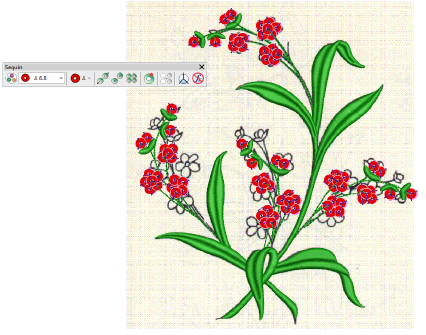

# Manual sequin digitizing

If you require precise control over the positioning and encoding of your sequin drops, EmbroideryStudio provides manual techniques for this purpose. Digitize your own sequin drops with fixings. Or even insert individual sequin-drop functions while traveling through the design.

## Related topics...

- [Digitize sequin drops with fixings](Digitize_sequin_drops_with_fixings)
- [Insert sequin drops](Insert_sequin_drops)
