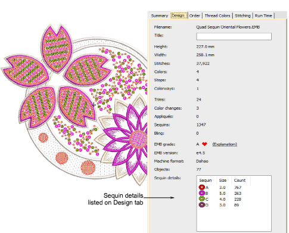
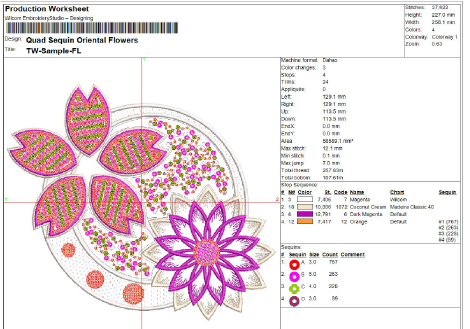

# Outputting sequin designs

|    | Use Docker > Design Information to view and modify design details prior to design approval or stitchout. |
| ------------------------------------------------------ | -------------------------------------------------------------------------------------------------------- |
|            | Click Standard > Print Preview to preview the production worksheet on screen.                            |
|  | Use Standard > Export Machine File to export the current design to a machine file for stitching.         |

Once your sequin design is ready for production, check all design details via the Design Information docker. The Design tab provides a summary of all sequins used in the design creation.

When you come to output your design to machine file, make sure you are using the correct file format. EmbroideryStudio currently supports the following...

| Machine format                                  | File format |
| ----------------------------------------------- | ----------- |
| Barudan FDR-3                                   | U??         |
| Barudan FDR-3 Chenille Combination              | U??         |
| Barudan FDR-II Twin Sequin                      | U??         |
| Barudan FDR-II Twin Sequin Chenille Combination | U??         |
| Dahao                                           | DST (Dahao) |
| Schiffli                                        | ESS         |
| SWF                                             | DST         |
| SWF Twin Sequin                                 | EBD         |
| Tajima                                          | DST         |
| Tajima TBF                                      | TBF         |
| ZSK                                             | ZSK         |

When you select Dahao multi-sequin DST as you output file format, the Drop Sequin functions are inserted according to Dahao multi-sequin requirements. Dahao control panels include a protocol to interpret this encoding. Tajima machines, on the other hand, strictly follow the DST file specification.

Note: For machine formats that have no sequin capability, the sequin palette will display. However, if you attempt to create a sequin object, fixing stitches will be digitized without sequin drops. No sequins appear.

Create a hard copy of your production worksheet to provide thread and sequin information for the machine operator.

## Related topics...

- [Printing design reports](../../Production/reports/Printing_design_reports)
- [Exporting designs for machine](../../Production/output/Exporting_designs_for_machine)
