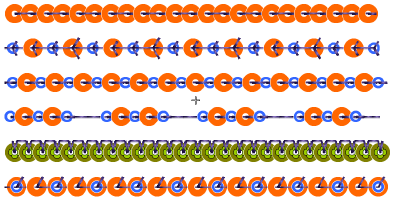
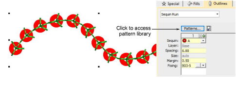
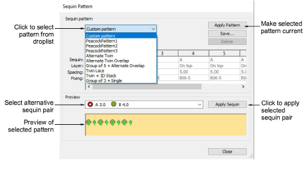
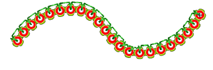
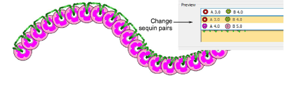
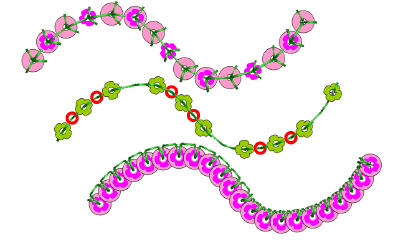
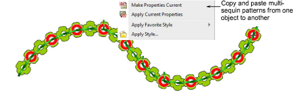

# Apply multi-sequin run patterns

|  | Use Sequin > Sequin Run Auto to create a string of sequins along a digitized line according to current settings. |                                                                                                            |
| -------------------------------------------------------- | ---------------------------------------------------------------------------------------------------------------- | ---------------------------------------------------------------------------------------------------------- |
|  |                                                                                                                  | Use Sequin > Sequin Palette to select from a user-defined palette of sequin shapes for the current design. |

In EmbroideryStudio, you select multi-sequin patterns from a pattern library. While patterns can be used with single sequins, they make more sense when applied to multi-sequin palettes.

## To apply a multi-sequin run pattern...

- Optionally, choose an existing sequin run and open Object Properties.

- Go to the Outlines > Sequin Run tab and click the Patterns button to access the library.
- Select a pattern from the menu. A preview is displayed.

- Click Apply Pattern to make the selected pattern current. The pattern is immediately applied to any selected sequin-run objects.

- Optionally, select a different sequin combination from the Preview Panel droplist and click Apply Sequin.

- Using the Sequin Run Auto tool, create your runs. The same pattern will apply until you change it.

- Optionally, use the Pattern table in the Object Properties docker to define your own patterns. See below.
- Optionally, make a selected object’s properties current, including multi-sequin patterns, and apply them to existing objects.

## Related topics...

- [Select sequin-capable machines](Select_sequin-capable_machines)
- [Selecting sequin mode](Selecting_sequin_mode)
- [Digitizing sequin runs](Digitizing_sequin_runs)
- [Creating multi-sequin runs](Creating_multi-sequin_runs)
- [Copy properties](../../Digitizing/properties/Copy_properties)
