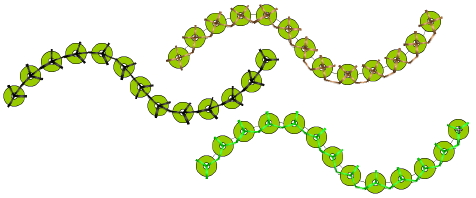
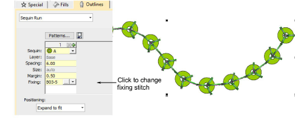
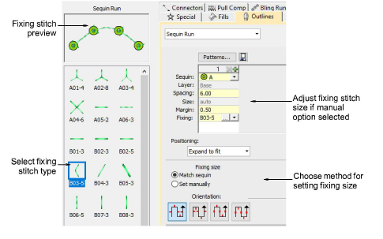
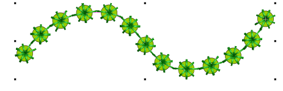
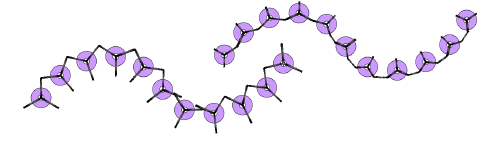
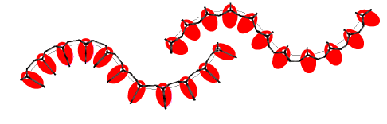
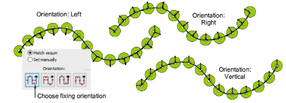

# Apply sequin fixings

|  | Use Sequin > Sequin Palette to select from a user-defined palette of sequin shapes for the current design. |
| -------------------------------------------------------- | ---------------------------------------------------------------------------------------------------------- |

You can select sequins before or after digitizing. Similarly, you can preset fixing stitches or change them at any stage.

::: tip
Digitizers sometimes want to generate a sequin run and overlay it with a plain run so that sequins are more securely fixed. Another reason for backtracking is to avoid jump stitches between objects. The Backtrack/Repeat tool is enabled for sequin-run objects. When applied, EmbroideryStudio generates manual stitches but leaves other functions unaffected. [See also Controlling stitch direction.](../../Quality/quality/Controlling_stitch_direction)
:::

## To apply sequin fixing stitches...

- To change fixing stitches, double-click to access object properties.

- Click the Chooser button in the Fixing field. The docker expands to reveal a library of fixing stitch types.

- Select the preferred type.

- To adjust fixing stitch size, select a method:

| Method       | Function                                                                                     |
| ------------ | -------------------------------------------------------------------------------------------- |
| Match sequin | Automatically sets a margin around the sequin so that fixing stitches don’t punch too close. |
| Set manually | Enables the Size field and lets you set a fixing stitch size independent of sequin size.     |

- If you choose the manual option, specify a value in the Size field. Size is measured from the center of the sequin. Enter a value from 2.50mm to 30.00mm.

- If you have chosen automatic matching, specify a margin for the fixing stitch in the Margin field. Enter a value from 0.20mm to 2.00mm. This ensures that the fixing stitch does not punch too close to the sequin.
- If you have chosen an eccentric sequin shape such as ‘ellipse’, fixing stitches automatically adapt to fit.

- To adjust fixing orientation, choose one of the preset directions – left/right, up/down.

## Related topics...

- [Create sequin fixings](../sequin_advanced/Create_sequin_fixings)
