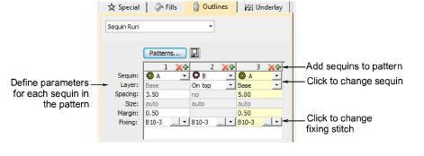

# Create multi-sequin run patterns

|  | Use Sequin > Sequin Run Auto to create a string of sequins along a digitized line according to current settings. |
| -------------------------------------------------------- | ---------------------------------------------------------------------------------------------------------------- |
|      | Use Docker > Object Properties to toggle the docker on/off. Set properties for the current design.               |

With EmbroideryStudio, you can create sequin run patterns and, optionally, save them to a pattern library for later use. Depending on machine capabilities, patterns may involve twin- or multi-sequin drops, with or without sequin stacking.

## Fixing stitches

With sequin patterns, the software actually allows you to apply a different fixing type to each sequin. Normally however, you would use the same fixing for all sequins in the pattern. Typically you would consider the cost of embroidery production against sequin weight in order to find a balance. The fewer stitches used, the lower the production cost. At the same time, you want sequins to stay in place during use or washing.

## Sequin stacks

For stacked sequins, pattern setup depends on machine capabilities. With Dahao format, the sequin stack is dropped and secured with a single fixing stitch. For non-Dahao machine formats, the first sequin is dropped, secured, and another dropped on top and stitched again.

## To create a multi-sequin run pattern...

- Create a sequin-run object with Sequin Run Auto or select an existing object. This allows you to preview your pattern as you go.

- Select the sequin combination you want to use.

- Open Object Properties. The Pattern table displays sequins currently in use.

- Add or remove sequins via the + and X buttons in the column header.
- Select a sequin from the droplist. The selected sample updates immediately.
- If your machine format supports it – e.g. Tajima TBF, Barudan FDR II or 3, SWF Twin Sequin, etc – you can set up stack sequins using the Layer field. Specify whether the sequin is to be stacked (‘on top’) or to form a new ‘base’.

- With Dahao format, you can choose sequin stacks from the combinations in the droplist. In this case, two or even three sequins can be dropped simultaneously and locked with a single fixing stitch.

::: tip
The digitizer needs to know the machine capabilities by heart. If an unsupported combination is selected – e.g. four sequin stack feeding – the drop code is ignored on the machine.
:::

- In the Spacing field, enter a nominal spacing for each sequin. Spacing is measured from the center of one sequin to the center of the next.

- In the Fixing field, select the type of fixing you want. Generally you’ll use the same fixing for all sequins in the pattern.
- When satisfied with the sequin-run pattern, click Save to record the pattern for future use.

- Enter a name for the pattern and click OK. It is now available in the Sequin Pattern dialog.

## Related topics...

- [Select sequin-capable machines](Select_sequin-capable_machines)
- [Digitizing sequin runs](Digitizing_sequin_runs)
- [Apply multi-sequin run patterns](Apply_multi-sequin_run_patterns)
