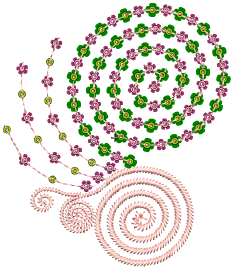

# Creating multi-sequin runs

EmbroideryStudio enables the creation of multi-sequin designs for supported machines. Create and visualize predefined patterns of sequin runs. These may comprise multiple sequins of different size, color, and shape.

::: tip
Twin-sequin mode also allows you to convert vector artwork to twin-sequin outlines. [See also Convert sequin artwork.](../sequin_advanced/Convert_sequin_artwork)
:::

## Related topics...

- [Stacked sequins](Stacked_sequins)
- [Apply multi-sequin run patterns](Apply_multi-sequin_run_patterns)
- [Create multi-sequin run patterns](Create_multi-sequin_run_patterns)
