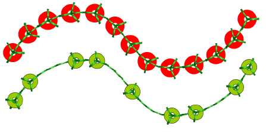
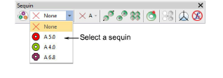
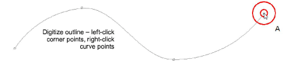
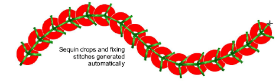
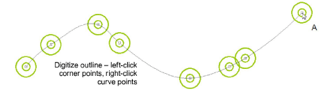
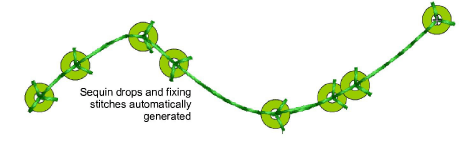

# Digitizing sequin runs

|            | Use Sequin > Sequin Run Auto to create a string of sequins along a digitized line according to current settings. |                                                                                                            |
| -------------------------------------------------------- | ---------------------------------------------------------------------------------------------------------------- | ---------------------------------------------------------------------------------------------------------- |
|        | Use Sequin > Sequin Run Manual to manually digitize sequin-drops along a digitized line.                         |                                                                                                            |
|  |                                                                                                                  | Use Sequin > Sequin Palette to select from a user-defined palette of sequin shapes for the current design. |

EmbroideryStudio provides tools for creating a string of sequins along a digitized line according to preset spacings or as marked by the digitizer.

Digitize sequin runs as you would motif runs. If you use the manual method, you define spacings between sequin-drops with every click you make. If you use the automatic method, sequin-drops are calculated according to current settings.

## To digitize a sequin run...

- Select a sequin-capable machine from the Select Machine Format dialog.
- Define your palette and select a sequin shape from the droplist. For simplicity, we show a single-sequin setup.

- To digitize a scalable sequin run, use the Sequin Run Auto tool. Enter reference points – left-click for corner points, right-click for curve points.

- Press Enter to complete. Sequin drops are automatically generated along with their fixing stitches. Automatic sequin runs can be scaled.

Tip: You can convert a normal run to sequin run by selecting and clicking the Sequin Run Auto tool.

- Alternatively, to control the exact placement of your sequin drops, use the Sequin Run Manual tool. Digitize individual sequin drops with left and right mouse clicks.

- Press Enter to complete. Sequin drops are generated at each reference point. Connecting and fixing stitches are automatically generated.

- Double-click to access object properties. Change sequins and adjust spacing properties as necessary.

- In the Spacing field, enter a nominal spacing. This is measured from the center to center. Minimum spacing is automatically calculated.
- Select a Positioning method from the droplist:

| Option          | Function                                                                                          |
| --------------- | ------------------------------------------------------------------------------------------------- |
| Exact           | Uses nominal spacing. This may result in gap formation at the end of the path.                    |
| Expand to fit   | Expands nominal spacing to evenly spread sequin distribution.                                     |
| Contract to fit | Contracts nominal spacing to evenly spread sequin distribution, resulting in an extra sequin.     |
| Manual          | Turns any sequin run into a manual run so that the number of sequins won’t change during editing. |

Note: If you change a manual sequin run to exact spacing, all sequin drops are recalculated and manual placements lost.

- To change fixing stitches, click the button in the Fixing field. The docker expands to show a library of fixing stitch types. See below.

## Related topics...

- [Select sequin-capable machines](Select_sequin-capable_machines)
- [Creating multi-sequin runs](Creating_multi-sequin_runs)
- [Manual sequin digitizing](../sequin_advanced/Manual_sequin_digitizing)
- [Editing sequin runs](Editing_sequin_runs)
- [Reinforce outlines](../../Quality/quality/Reinforce_outlines)
- [Adjust entry/exit points](../../Quality/connectors/Adjust_entry_exit_points)
