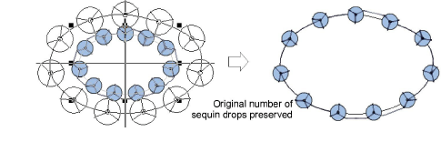

# Editing sequin runs

|    | Use Select > Select Object to resize objects using selection handles.  |
| ---------------------------------------------- | ---------------------------------------------------------------------- |
|  | Use Reshape > Reshape Object to reshape selected sequin-run objects.   |
|        | Use Sequin > Sequin Edit to fine-tune placement of individual sequins. |

You have complete control over scaling and reshaping sequin-run objects. You can also manually fine-tune sequin spacings as well as remove or add individual sequins. You can even edit individual fixing stitches.

::: info Note
Performing manual edits to sequin-run objects automatically deselects all options. If you reset to Exact, Contract to fit, or Expand to fit, all manual edits are lost and sequin drops recalculated.
:::

## To edit a sequin run...

- Scale sequin-run objects by clicking and dragging selection handles, or by adjusting general properties.
- If the object is created with the Sequin Run Auto tool, the sequin drops are automatically recalculated.

- If the object is created with the Sequin Run Manual tool, the original number of sequin drops is preserved.

- Reshape sequin run lines with the Reshape tool. Add reshape nodes by left- or right-clicking the outline.

- Fine-tune individual sequin spacings with the Sequin Edit tool – click-and-drag a diamond [control point](../../glossary/glossary). Hold down Shift or Ctrl keys to select a range or multiple control points.

- Delete selected sequins by pressing Delete.

- Add sequins by holding down the Alt key and clicking the run. If you are in multi-sequin mode, select options, including stack sequins, from the popup menu.

- To replace a sequin in multi-sequin mode, click a diamond control point and select an alternative from the Manual Sequin droplist.

- In multi-sequin mode, right-click a diamond control point while modifying a particular sequin. Options include: removing the sequin, replacing it, adding another sequin on top or beneath.

## Related topics...

- [Scaling objects](../../Modifying/transform/Scaling_objects)
- [Reshaping embroidery objects](../../Modifying/reshape/Reshaping_embroidery_objects)
