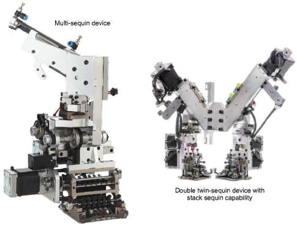

# Machine capabilities

Machine capabilities vary widely. Some machines only support single-sequin devices. These may be mounted on the first or last needle, or sometimes both. Some machines support twin-sequin devices. These too can be mounted on first and last needles. Newer machines can support multi-sequin devices. These may perform consecutive sequin feeds – one at a time whilst stitching. Some may allow ‘stack feeding’, where multiple sequins are dropped and secured with a single fixing stitch.

In summary, the main sequin device configurations include...

- Machines supporting one sequin per device. These feed only one sequin at a time.
- Machines supporting one or two devices per machine head, usually on first or last needles.
- Machines supporting twin-sequin devices with no stack feeding – e.g. Barudan FDR-II Twin Sequin, Tajima TBF, SWF Twin Sequin.
- Machines supporting twin-sequin devices or even double twin-sequin devices with stack feeding – e.g. Dahao.
- Machines supporting multiple sequins per device – four, six, eight, and possibly more sequins – with or without stack feeding.

Note: An increasing number of machines support multiple decoration types including sequins in combination with chenille, beading, cording, and others.

## Single- vs twin-sequins

Single and twin configurations still represent the most common type used in sequin production. Even then, different configurations and design types are possible:

| Configuration                           | Design type                                                                                                                                   |
| --------------------------------------- | --------------------------------------------------------------------------------------------------------------------------------------------- |
| Single-sequin device on one needle      | The simplest configuration possible, this allows you to produce designs incorporating single-sequin fills, runs, and individual sequin drops. |
| Single-sequin device on two needles     | Usually mounted on first and last needles, this setup allows you to incorporate two types of single-sequin fills, runs, and sequin drops.     |
| Twin-sequin device on one needle        | This configuration allows you to incorporate twin-sequin runs and fills. Some configurations (Dahao) also allow twin stacking.                |
| Twin-sequin device on two needles       | This configuration allows you to incorporate two types of twin-sequin runs and fills. Again, some may allow twin stacking.                    |
| Double twin-sequin device on one needle | This configuration allows you to incorporate two types of twin-sequin or quad-sequin runs and fills, as well as twin or quad stacking.        |

Note: The kinds of design work you can do with two single-sequin devices and a single twin-sequin device are different. The twin single-sequin setup will allow you to include runs and fills of either sequin, but not both together in the same run or fill.
