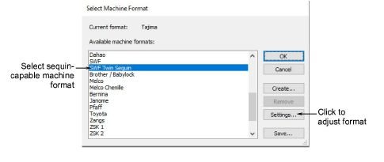
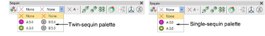
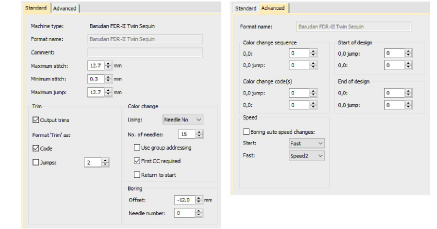

# Select sequin-capable machines

Before you can use the Sequin tools, you need to choose a suitable machine format.

## To select a sequin-capable machine...

1Select Design > Select Machine Format.

2From the Available Machine Formats list, select a sequin-capable machine format – e.g. Schiffli, Tajima, Barudan, SWF, ZSK, etc.

3Click OK. Default sequins appear in the sequin palette. It is ready to be configured. If you have selected a twin-sequin-capable machine, sequins are displayed in pairs.

Note: Different machines require different presets. Typical modifiable values include stitch and jump length, trim functions and color change functions. Use the Machine Format Settings dialog to customize values if outputting to a specific machine format.

## Related topics...

- [Embroidery machine formats](../../Basics/basics/Embroidery_machine_formats)
- [Exporting designs for machine](../../Production/output/Exporting_designs_for_machine)
- [Creating multi-sequin runs](Creating_multi-sequin_runs)
