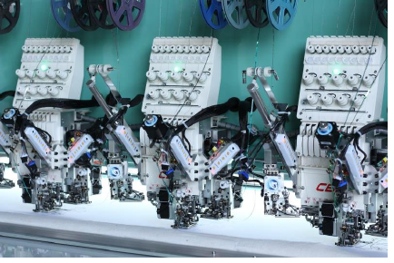

# Selecting sequin mode

Before using the Sequin tools, you need a machine format that supports sequin output. You can then set up a dedicated sequin palette from a list of predefined or custom shapes and sizes.

## Related topics...

- [Machine capabilities](Machine_capabilities)
- [Sequin machine formats](Sequin_machine_formats)
- [Single- vs twin-sequins](Machine_capabilities)
- [Select sequin-capable machines](Select_sequin-capable_machines)
- [Setting up sequin palettes](Setting_up_sequin_palettes)
